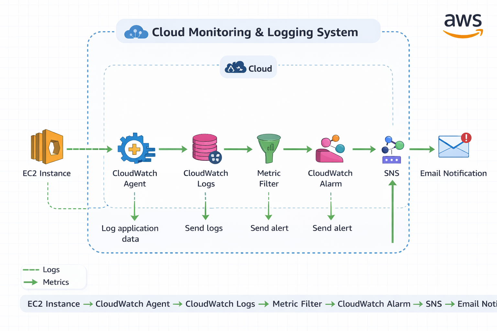
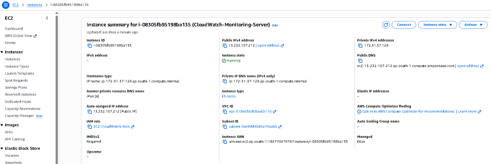
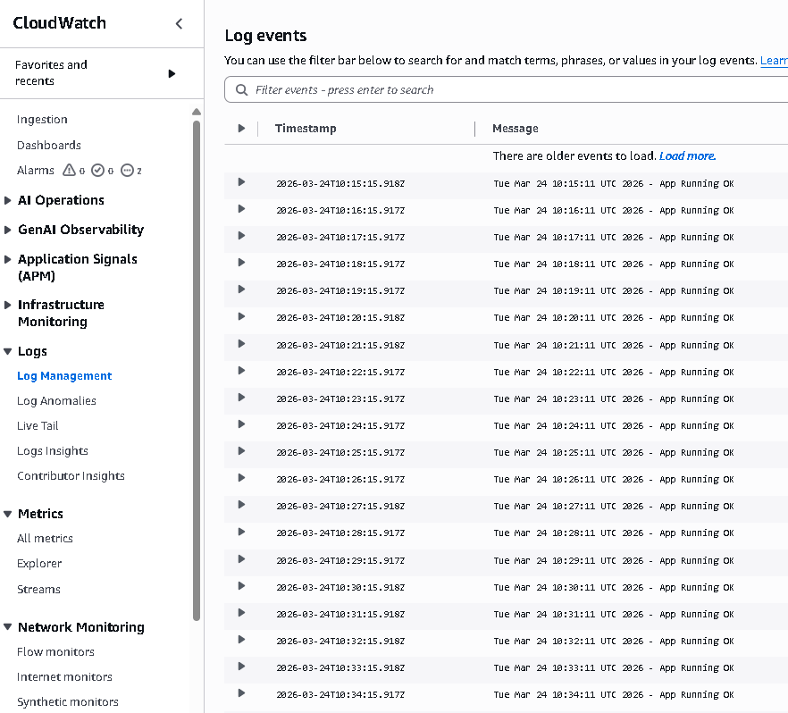
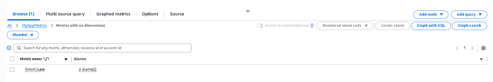

# ☁️ Cloud Monitoring & Logging System (AWS)

<p align="center">
  
</p>

<p align="center">
  
  
  
  
  
</p>

---

## 📌 Overview

A production-style monitoring pipeline that ingests application logs from an EC2 instance, transforms them into metrics using CloudWatch metric filters, and triggers real-time alerts via SNS email notifications.

---

## 🧭 Architecture Flow

```text
EC2 Instance
   ↓
CloudWatch Agent
   ↓
CloudWatch Logs
   ↓
Metric Filter (pattern: ERROR)
   ↓
CloudWatch Alarm (ErrorCount >= 1)
   ↓
SNS Topic
   ↓
Email Notification
```

---

## 🚀 Key Features

* 🔍 Real-time log ingestion from EC2 (`/var/log/myapp.log`)
* 📊 Custom metric creation from logs (`ErrorCount`)
* 🚨 Automated alerting with CloudWatch Alarms
* 📧 Email notifications via SNS (confirmed subscription)
* 🧱 IAM role-based secure configuration (no static creds)
* 📈 Dashboard-ready metrics (CPU, memory, disk, error rate)

---

## 📂 Project Structure

```text
project-root/
│
├── architecture.png
│
└── screenshots/
    ├── Ec2.png
    ├── Logs.png
    ├── Metrics.png
    └── Email alert.png
```

---

## 📸 Screenshots

### 🔹 EC2 Instance (App + Log Generator)

<p align="center">
  
</p>

### 🔹 CloudWatch Logs (Centralized Logging)

<p align="center">
  
</p>

### 🔹 Metrics (ErrorCount from Logs)

<p align="center">
  
</p>

### 🔹 Email Alert (SNS Notification)

<p align="center">
  
</p>

---

## ⚙️ Setup (Concise)

### 1) EC2 + Sample Logs

```bash
sudo yum install httpd -y
sudo systemctl start httpd

# generate logs
sudo bash -c 'while true; do echo "$(date) - App Running OK" >> /var/log/myapp.log; sleep 5; done' &
```

### 2) Install & Configure CloudWatch Agent

```bash
sudo yum install amazon-cloudwatch-agent -y
```

* Log file: `/var/log/myapp.log`
* Log group: `/aws/ec2/myapp`
* Store config in SSM: `AmazonCloudWatch-linux`

### 3) Metric Filter

* Pattern: `ERROR`
* Namespace: `MyAppMetrics`
* Metric: `ErrorCount` (value: 1)

### 4) Alarm

* Condition: `ErrorCount >= 1` for 1 datapoint within 5 minutes
* Action: Send notification to SNS topic

### 5) SNS (Email)

* Create topic → add email subscription → **confirm subscription**
* Ensure alarm action points to this topic

---

## 🧪 Test

```bash
sudo bash -c 'echo "ERROR: Test Alert" >> /var/log/myapp.log'
```

**Expected:**

* Metric increments
* Alarm → **ALARM**
* Email received 📧

---

## 🛡️ Troubleshooting

* **No logs in CloudWatch:**
  Check agent status: `sudo systemctl status amazon-cloudwatch-agent`

* **No metric data:**
  Ensure new `ERROR` logs are generated after filter creation

* **No email:**
  SNS subscription must be **Confirmed** (not Pending/Deleted)
  Verify alarm **Actions** reference the correct SNS topic

---

## 🧠 What I Learned

* Log-to-metric transformation (metric filters)
* Alarm lifecycle (INSUFFICIENT_DATA → ALARM → OK)
* SNS subscription confirmation & delivery nuances
* IAM role-based access for agents (no static keys)

---

## ⭐ Status

**Production-ready demo** with end-to-end observability and alerting.

---

<p align="center">
  ⭐ If you find this useful, consider starring the repo!
</p>

<p align="center">
  
</p>